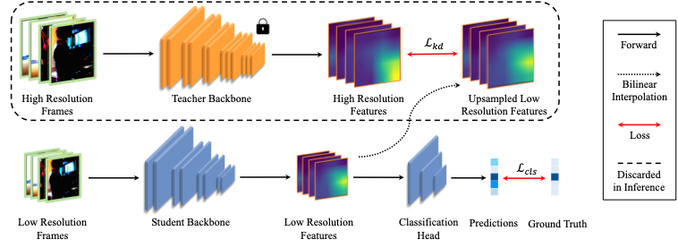

# Rethinking Resolution in the Context of Efficient Video Recognition

<p align="center">
    <a href="https://nips.cc/virtual/2022/poster/55053"></a>
    <a href="https://arxiv.org/abs/2209.12797"></a>
  <a href="https://github.com/CVMI-Lab/SlotCon/blob/master/LICENSE"></a>
</p>
<p align="center">
	Rethinking Resolution in the Context of Efficient Video Recognition (NeurIPS 2022)<br>
  By
  Chuofan Ma, 
  Qiushan Guo, 
  Yi Jiang, 
  Ping Luo,
  Zehuan Yuan, and 
  <a href="https://xjqi.github.io/">Xiaojuan Qi</a>.
</p>

## Introduction

We introduce cross-resolution knowledge distillation (ResKD) to make the most of low-resolution frames for efficient video recognition. In the training phase, a pre-trained teacher network taking high-resolution frames as input is leveraged to guide the learning of a student network on low-resolution
frames. While for evaluation, only the student is deployed to make predictions. This simple but effective method largely boosts the boost recognition accuracy on low-resolution frames, and is compatible with state-of-the-art architectures, i.e., 3D-CNNs and Video Transformers. 



## Setup Environment
This project is developed with `CUDA 11.0`, `PyTorch 1.7.1`, and `Python 3.7`.
Please be aware of possible code compatibility issues if you are using another version.
The following is an example of setting up the experimental environment:
```shell script
git clone https://github.com/CVMI-Lab/ResKD.git
cd ResKD
pip install torch==1.7.1+cu110 torchvision==0.8.2+cu110 torchaudio==0.7.2 -f https://download.pytorch.org/whl/torch_stable.html
pip install mmcv-full==1.4.0 -f https://download.openmmlab.com/mmcv/dist/cu110/torch1.7.0/index.html
pip install -r requirements/build.txt
pip install -v -e .
pip install tqdm
pip install timm
cd apex
pip install -v --disable-pip-version-check --no-cache-dir --global-option="--cpp_ext" --global-option="--cuda_ext" ./
```

## Download Datasets
Four benchmarks are involved for training and evaluation.
Please download the corresponding dataset(s) from the official websites and place 
or sim-link them under `$ResKD_ROOT/data/`. (You don't have to download all of them at one time)
```shell script
$ResKD_ROOT/data/
    actnet/
    sthv2/
    fcvid/
    kinetics400/
```
* [ActivityNet](http://activity-net.org/download.html). After downloading the raw videos, 
extract frames using `tools/data/activitynet/video2img.py`. To reproduce the results in our paper, you need to
extract frames in `png` format at a frame rate of `4`. The extracted frames will take roughly 1.9T space. If you 
do not have enough space, you may consider extracting frames in `jpg` format at the default frame rate, which
will sacrifice accuracy slightlty.
* [Mini-Kinetics and Kinetics-400](https://github.com/cvdfoundation/kinetics-dataset). We use the Kinetics-400
version provided by [Common Visual Data Foundation](https://github.com/cvdfoundation). Remeber to filter out 
corrupted videos before using the dataset. Mini-Kinetics is a subset of Kinetics-400. You can get the 
train/val splits files from [AR-net](https://github.com/mengyuest/AR-Net#dataset-preparation).
* [FCVID](https://drive.google.com/drive/folders/1cPSc3neTQwvtSPiVcjVZrj0RvXrKY5xj). Following the same pipeline to 
extract frames as Activitynet.
* [Something Something V2](https://developer.qualcomm.com/software/ai-datasets/something-something).


You may need to modify the corresponding file paths in the config files after data preparation.

## Pretrained Teacher Models
| Backbone |   Dataset   | Config | Model |
|:---------:|:-----------:|:------:|:-----:|
| TSN_Res50 | actnet | [tsn_r50_1x1x16_50e_actnet_rgb.py](configs/myconfig/tsn/tsn_r50_1x1x16_50e_actnet_rgb.py) |  [ckpt](https://drive.google.com/file/d/1Q4JdKM4FbiEOfbtLvsDGtVuwdqiskVi4/view?usp=sharing)  |
| TSM_Res50 | sthv2 | [tsm_r50_1x1x8_50e_sthv2_rgb.py](configs/myconfig/tsm/tsm_r50_1x1x8_50e_sthv2_rgb.py) |  [ckpt](https://drive.google.com/file/d/1m3aW7RfmfuHkVUyCsJuS9PCu05n_J8-T/view?usp=sharing)  |
| TSN_Res152 | actnet | [tsn_r152_1x1x16_50e_actnet_rgb.py](configs/myconfig/tsn/tsn_r152_1x1x16_50e_actnet_rgb.py) |  [ckpt](https://drive.google.com/file/d/1B36QuuXowAdLmWKF5o8IFtXIRnMWlbyJ/view?usp=sharing)  |
| TSN_Res152 | minik | [tsn_r152_1x1x8_50e_minik_rgb.py](configs/myconfig/tsn/tsn_r152_1x1x8_50e_minik_rgb.py) |  [ckpt](https://drive.google.com/file/d/1pz3O8np-hkXkHLh6dVsv6yt2k02XrrKL/view?usp=sharing)  |
| TSN_Res152 | fcvid | [tsn_r152_1x1x16_50e_fcvid_rgb.py](configs/myconfig/tsn/tsn_r152_1x1x16_50e_fcvid_rgb.py) |  [ckpt](https://drive.google.com/file/d/1cZdKWYd0wnAXM3y88ppEfDQgDHGfmj35/view?usp=sharing)  |
| Slowonly_Res50 | k400 | [slowonly_r50_8x8x1_150e_k400_rgb.py](configs/myconfig/slowonly/slowonly_r50_8x8x1_150e_k400_rgb.py) |  [ckpt](https://drive.google.com/file/d/1D7P9ub0HVeg3G9mX_JboAPLT8EehP5Rp/view?usp=sharing)  |
| Swin_Base | k400 | [swin_base_32x2x1_50e_k400.py](configs/myconfig/swin/swin_base_32x2x1_50e_k400.py) |  [ckpt](https://drive.google.com/file/d/1s7zs-lIZD5AKCMNPSG4hmhuArM60CLeE/view?usp=sharing)  |

[comment]: <> (### ResKD Models &#40;containing teacher & student&#41;)

[comment]: <> (| Teacher Backbone | Student Backbone |   Dataset   | Accurancy / mAP &#40;student&#41; | Config | Model |)

[comment]: <> (|:----------------:|:----------------:|:-----------:|:-------------------------:|:------:|:-----:|)

[comment]: <> (| TSN_Res152 | TSN_Res50 | actnet |  80.0%  | [rkd_r152_1x1x16_200e_actnet.py]&#40;configs/myconfig/rkd/rkd_r152_1x1x16_200e_actnet.py&#41; |  [ckpt]&#40;&#41;  |)

[comment]: <> (| TSN_Res152 | TSN_Res50 | minik |  75.4%  | [rkd_r152_1x1x8_100e_minik.py]&#40;configs/myconfig/rkd/rkd_r152_1x1x8_100e_minik.py&#41; |  [ckpt]&#40;&#41;  |)

[comment]: <> (| TSM_Res50 | TSM_Res50 | sthv2 |   60.6%  | [rkd_tsm_1x1x8_50e_sthv2.py]&#40;configs/myconfig/rkd/rkd_tsm_1x1x8_100e_sthv2.py&#41; |  [ckpt]&#40;&#41;  |)

[comment]: <> (| Slowonly_Res50 | Slowonly_Res50 | k400 |  72.7%  | [rkd_slowonly_8x8x1_150e_k400.py]&#40;configs/myconfig/rkd/rkd_slowonly_8x8x1_150e_k400.py&#41; |  [ckpt]&#40;&#41;  |)

[comment]: <> (| Swin_Base | Swin_Small | k400 |  80.0%  | [rkd_swins_32x2x1_60e_k400.py]&#40;configs/myconfig/rkd/rkd_swins_32x2x1_60e_k400.py&#41; |  [ckpt]&#40;&#41;  |)


## Training and Evaluation Scripts
Here we provide some examples to train and test a model. For more details
of the training and evaluation scripts, you may refer to the [documents](https://github.com/open-mmlab/mmaction2/blob/master/docs/getting_started.md#inference-with-pre-trained-models) of mmaction2.
### Inference with pretrained models
* Evaluation on ActivityNet
```shell script
./tools/dist_test.sh ${CONFIG_FILE} ${CHECKPOINT_FILE} ${GPU_NUM} --eval mean_average_precision
```
* Evaluation on Mini-kinetics, Something Something V2, and FCVID
```shell script
./tools/dist_test.sh ${CONFIG_FILE} ${CHECKPOINT_FILE} ${GPU_NUM} --eval top_k_accuracy
```

### Training from scratch
```shell script
./tools/dist_train.sh ${CONFIG_FILE} ${GPU_NUM} --validate --test-last
```


## Citation

If you find this repo useful for your research, please consider citing our paper:
```
@inproceedings{
    ma2022rethinking,
    title={Rethinking Resolution in the Context of Efficient Video Recognition},
    author={Chuofan Ma and Qiushan Guo and Yi Jiang and Ping Luo and Zehuan Yuan and XIAOJUAN QI},
    booktitle={Advances in Neural Information Processing Systems},
    year={2022},
}
```

## Acknowledgment
Our codebase builds upon several existing publicly available codes. Specifically, we have modified and integrated the following repos into this project:

* https://github.com/open-mmlab/mmaction2
* https://github.com/SwinTransformer/Video-Swin-Transformer
* https://github.com/blackfeather-wang/AdaFocus

## License
This project is licensed under the Apache License 2.0 - see the [LICENSE](LICENSE) file for details.